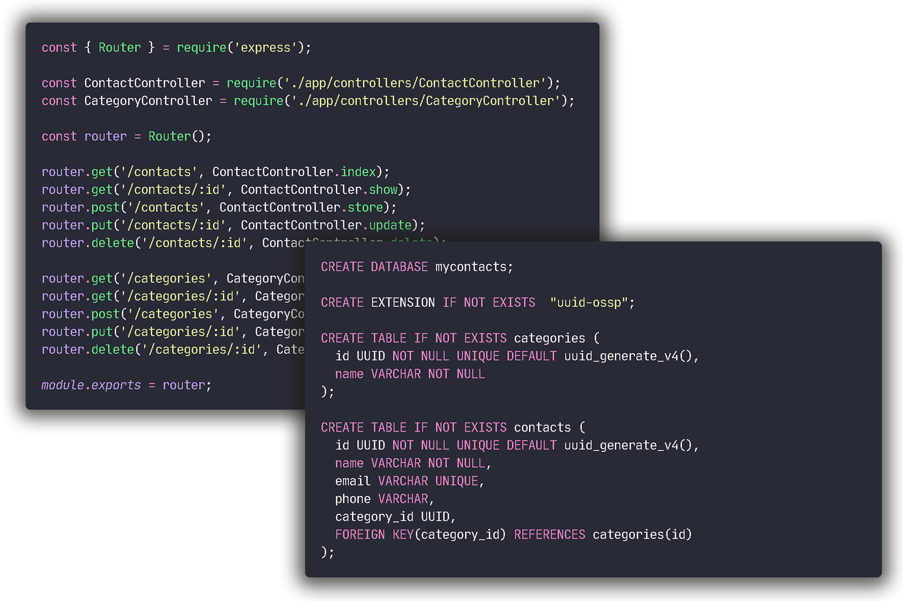

<h1 align="center">My Contacts</h1>

  

## ✨ Technologies

This project has been setted with the following technologies:

- [Node.js](https://nodejs.org/en/)
- [Express](https://expressjs.com/pt-br/)
- [Docker](https://www.docker.com/)
- [PostegreSQL](https://www.postgresql.org/)
- [ESLint](https://eslint.org/)

## 💻 Project

Node API with SQL querys, using PostgreSQL's Docker image, ESLint and .editorconfig patterns. You can insert contacts and their categories.

## 🚀 How to run

- Clone this repository.
- Run `yarn` to download all dependencies.
- Set PostgreSQL database online.
- Run `src/database/schema.sql` queries on database CLI.
- Run `yarn dev` to start the application.

Now available at `http://localhost:3000`
